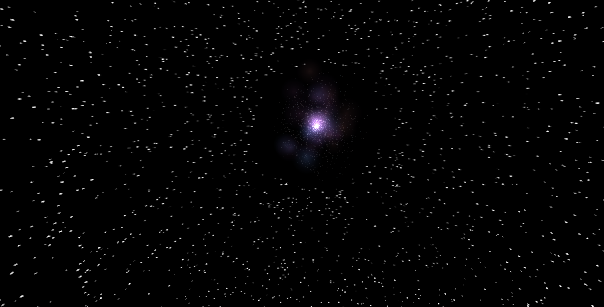

# vibe-galaxy

Immerse yourself in the cosmos with **vibe-galaxy**! This project generates a stunning and interactive visual representation of a galaxy, crafted entirely with the magic of vanilla JavaScript and the HTML Canvas API. Explore the swirling stars and nebulae right in your browser.

## Preview



## Key Features

*   Interactive galaxy visualization.
*   Built purely with vanilla JavaScript, HTML, and CSS.
*   Simple structure, easy to understand and modify.

## How to Use

1.  Clone the repository:
    ```bash
    git clone https://github.com/junior-rumiche/vibe-galaxy.git
    ```
2.  Navigate to the project directory:
    ```bash
    cd vibe-galaxy
    ```
3.  Open the `index.html` file in your web browser.

## Technologies Used

*   HTML
*   CSS
*   JavaScript

## Author

*   **junior-rumiche** - *Initial work* - [GitHub](https://github.com/junior-rumiche) (Created with the assistance of Google Gemini)